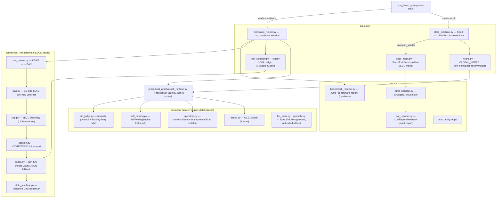
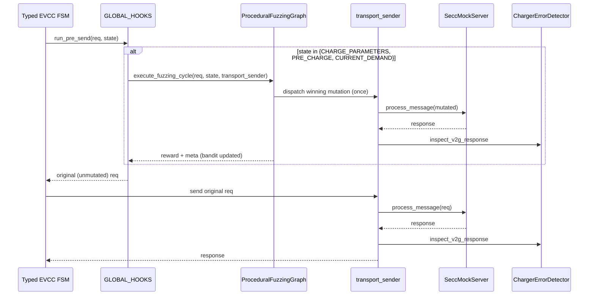
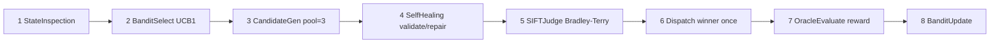
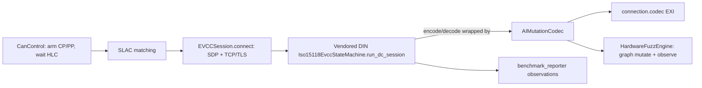

# Framework Schema (As-Built)

How EVCC-SIFT-Mutator is actually wired today. This complements two sibling
docs: `ARCHITECTURE.md` states the theoretical/aspirational design, and
`SIMULATION.md` states what each fixture does and does not exercise. This file
describes the concrete runtime: the modules, the two execution paths, the AI
mutation cycle, and the message bridge, grounded in the current code.

Honesty note carried over from `SIMULATION.md`: a rejected request, a closed
connection, or a simulated interlock is an *observation*, not a confirmed
defect. Mock mode prints a security-styled report for demonstration; hardware
mode writes measured observations. Neither is a conformance verdict.

## 1. Component Map

## 2. Mock Path (`--mode mock`, default)

`run_fuzzer_session` builds a `SeccMockServer`, a `ChargerErrorDetector`, and a
`ProceduralFuzzingGraph`. It wires a `transport_sender` that calls
`secc_mock.process_message()` and feeds each pair to the detector. When
mutations are enabled it registers one pre-send hook on `GLOBAL_HOOKS`.

The important as-built detail: the hook fuzzes only three high-impact states
(`CHARGE_PARAMETERS`, `PRE_CHARGE`, `CURRENT_DEMAND`). For those, it runs a full
fuzzing cycle that dispatches the tournament winner to the mock once, then
returns the original, unmutated request, which the state machine then sends
again. So the mock sees two frames for a mutated state (mutation, then
canonical), and the session's own success/failure is driven by the canonical
frame. The mutation's effect shows up in the bandit reward and in the mock's
sticky anomaly/emergency-stop flags (reset per iteration, not per message).
This is the attribution caveat `SIMULATION.md` flags; use the notebook's
single-dispatch trials for clean per-mutation evidence.

After the cycle loop, `CVEReportGenerator.compile_from_anomalies()` turns
detector events plus mock anomalies into a CVSS/CWE-styled Markdown report. The
labels and synthetic severities are a demonstration, not validated findings.

## 3. The AI Mutation Cycle (8 graph nodes)

`ProceduralFuzzingGraph.execute_fuzzing_cycle` is the shared brain used by both
paths. It is fully deterministic Python; no model is called on the default
offline path.

Two honest specifics about the arms:
- The bandit exposes 4 arms, but candidate generation only branches on
  `ARM_NUMERICAL_BOUNDARY` and `ARM_SEMANTIC_SPOOF`; the other two fall back to
  the numerical-boundary mutator. `mutate_sequence_inversion` and
  `mutate_slac_frame` exist but are not wired into `execute_fuzzing_cycle`.
- The SIFT judge is a deterministic severity heuristic feeding a
  Bradley-Terry minorization-maximization fit; it does not query an LLM.

Reward mapping in `_compute_reward` (response inspected by attribute):

| Response signal | Reward |
| --- | --- |
| `None` (connection drop) | +10.0 |
| `FAILED_SequenceError` | +5.0 |
| `FAILED_WrongChargeParameter` | +4.0 |
| other `FAILED` | +2.0 |
| accepted / OK | +0.5 |
| any candidate self-healed | +1.0 |

## 4. Hardware Path (`--mode hardware`)

`run_hardware_session` validates config, then checks
`connection.capability_summary()` and `codec.is_compliant()` before touching
any device. Missing deps or Java return exit code 2 with a benchmark report
written; the module imports cleanly offline because `connection.codec` is only
imported lazily.

Per session it brings the real stack up in order and runs the *vendored* DIN
sequencer, with the AI injected at the pre-EXI-encode layer:

`AIMutationCodec` mutates only targeted request names (default
`CurrentDemandReq`). Per the `AGENTS.md` self-healing invariant, a mutated frame
that fails EXI encoding is never put on the wire; the codec falls back to the
canonical schema-valid frame and increments `encoding_fallbacks`. The reward
loop closes on the matching decode. Exit codes: 0 complete, 1 incomplete,
2 setup error, 130 interrupted.

## 5. Message Bridge (`simulator/real_transport.py`)

Two representations meet at the bridge:

| Harness side (typed) | Wire side (DIN dict) |
| --- | --- |
| `V2GMessage` pydantic objects | `{"name", "session_id", "fields"}` |
| mutated by bandit/operators, inspected by oracles | encoded to EXI by `connection.codec`, framed by `EVCCSession` |

Translation helpers: `typed_to_din`, `din_req_to_typed`, `din_res_to_typed`,
`merge_mutated_fields`, with `phys`/`unphys` for DIN PhysicalValue blocks and
`map_response_code` to fold unknown firmware codes into the typed enum.

The bridge also provides `RealChargerTransport`, a
`transport_sender(typed) -> typed` adapter that would let the harness's own
typed state machine drive a real charger (SAP handshake, `EVSEProcessing`
polling, CP B->C callback handled internally). It is available but the CLI's
hardware mode currently wires the vendored DIN sequencer plus `AIMutationCodec`,
because that sequence is already verified against real hardware.
